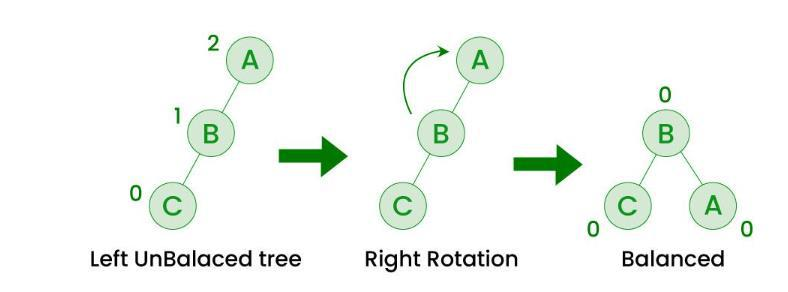

# AVL Trees

An AVL tree is **self-balancing** binary search tree.

Because the AVL tree is always balanced, search will be *O(log n)*,
no matter what the order of the input data. 

### Binary Search Trees

A **binary tree** is either is either empty (`Empty`) or else it
        it has a root node and two subtrees (which are binary trees).
        The root node `t` has a key, `t.key`. Ordinarily it would also
        hold other data (`t.data`), which the user would like to find by
        searching for the key.  Since this attribute has no impact on 
        how insertion and search take place, we disregard it here. 
        Note that a newly inserted node will always appear as a leaf
        in the tree. 
		
In a **binary search tree (BST)** the BST invariant is always maintained:\
for each 
        subtree t, with root key t.key, the left subtree, t.left, 
        contains no node with key greater than k, and the right subtree,
        t.right, contains no node with key smaller than k.

### AVL tree balancing

The AVL tree preserves the balance of the tree by (1) checking after every insertion to detect
when the tree has become unbalanced
and (2) performing one or more rotation operations to restore balance when necessary.
Unbalanced is defined as a difference of more than `1` between the heights of the left and right subtrees.

(Here **MAYBE insert small pictures, thumbnails?** to show -- unbalanced at gp of new node, 
and also balanced at gp but unblanaced at ggp.)

A temporarily unbalanced AVL tree takes on one of two configurations, *zig-zag* or *zig-zig*. The 
sequence of rotations depends on the configuration around the node where the imbalance is detected. 

### Zig-zig case

The *zig-zig* configuration has two mirror-image cases: the child and grandchild nodes or subtrees of the unbalanced node are 
either (1) both left subtrees or (2) both right subtrees. 


## The left-left case

If the new key was added to the left child of the left child (the
*left-left* case), the balance can be
restored with a single _**Right Rotation**_ operation.

Note that the imbalance may be located further up the tree than the immediate grandparent of the newly inserted node:

**Insert very small diagrams showing (a) imbalance of the grandparent-parent and (b) imbalance of the great grandparent** 
*Note that all diagrams should hae nodes in BST order, and where the subtrees are not necessarily single nodes, represent them as subtree-triangles* 
*Have arrow showing which node is not in blanace*


, as explained in the diagram
below. The 6 and 4 nodes and the edge between them rotate clockwise, and
the 5 node changes parents from 4 to 6. This reduces the distance from
the root to the 1 (where the new node was added), restoring the balance
(the distance to the node rooted at 7 is increased but this does not
cause the AVL tree balance condition to be violated).  Right rotation is
done by calling rightRotate(t6), where t6 is the tree rooted at 6.

 This picture is from Greek for Geeks, and is only a placeholder to show proof of concept inserting diagrams, and to check things like size and cropping.
  


```
      6                           2
     / \     Right Rotation      / \
    2   7    - - - - - - - >    1   6
   / \       < - - - - - - -       / \
  1   4       Left Rotation       4   7
```

## The right-right case

The right-right case is the exact opposite. If the tree on the right in
the diagram above is too unbalanced due to insertion into the subtree
rooted at 7, we can call rightRotate(t2) to lift that subtree and lower
the 1 subtree.

## The left-right case (double rotation)

If the new key was added to the right child of the left child (the
left-right case) and the resulting tree is too unbalanced, the balance can be
restored with a left rotation at node 2 followed by a right rotation at
node 6.
```
      6      Rotate           6       Rotate           4
     / \    left at 2        / \     right at 6      /   \
    2   7   - - - - - >     4   7    - - - - - >    2     6
   / \                     / \                     / \   / \
  1   4                   2   5                   1   3 5   7
     / \                 / \
    3   5               1   3
```
Nodes in the subtree rooted at 4 (where the extra element was added,
making the tree unbalanced) are moved closer to the root.
Trees rooted at 1, 3, 5 and 7 are not affected, except the distances from
the root of 3, 5 and 7 are changed by one, affecting the overall balance.

## right-left case (double rotation):

If the new key was added to the left child of the right child (the
right-left case) and the resulting tree is too unbalanced, it is a mirror
image of the left-right case:

```
      2      Rotate           2       Rotate           4
     / \    right at 6       / \     left at 2       /   \
    1   6   - - - - - >     1   4    - - - - - >    2     6
       / \                     / \                 / \   / \
      4   7                   3   6               1   3 5   7
     / \                         / \
    3   5                       5   7
```
